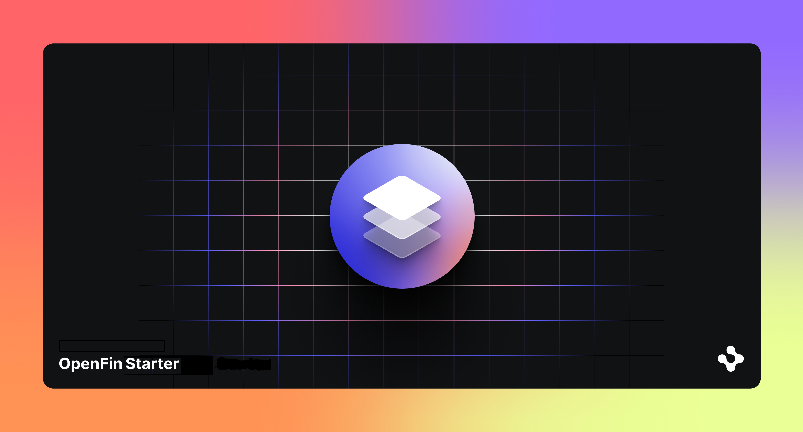

> **_:information_source: OpenFin Node Adapter:_** [OpenFin Node Adapter](https://www.openfin.co/workspace/) is a commercial product and this repo is for evaluation purposes. Use of the OpenFin Node Adapter, OpenFin Container and OpenFin Workspace components is only granted pursuant to a license from OpenFin. Please [**contact us**](https://www.openfin.co/workspace/poc/) if you would like to request a developer evaluation key or to discuss a production license.

## OpenFin Node Adapter ([@openfin/node-adapter](https://www.npmjs.com/package/@openfin/node-adapter))

The OpenFin Node Adapter allows the use of the OpenFin API from node.js. Please note that the launch and connect methods are specific to a node environment. This repo contains examples of how you can use the OpenFin Node Adapter.

| Documentation                                                  | Description                                                                             |
| -------------------------------------------------------------- | --------------------------------------------------------------------------------------- |
| [Use a SideCar App - Basic](./how-to/use-a-sidecar-app-basic/) | This example shows you how you can launch a node app as an app asset and connect to it. |
| [Connect To A InteropBroker - Basic](./how-to/connect-to-a-interopbroker-basic/) | This example shows you how Node can connect to a Platform's InteropBroker through the node adapter. |
