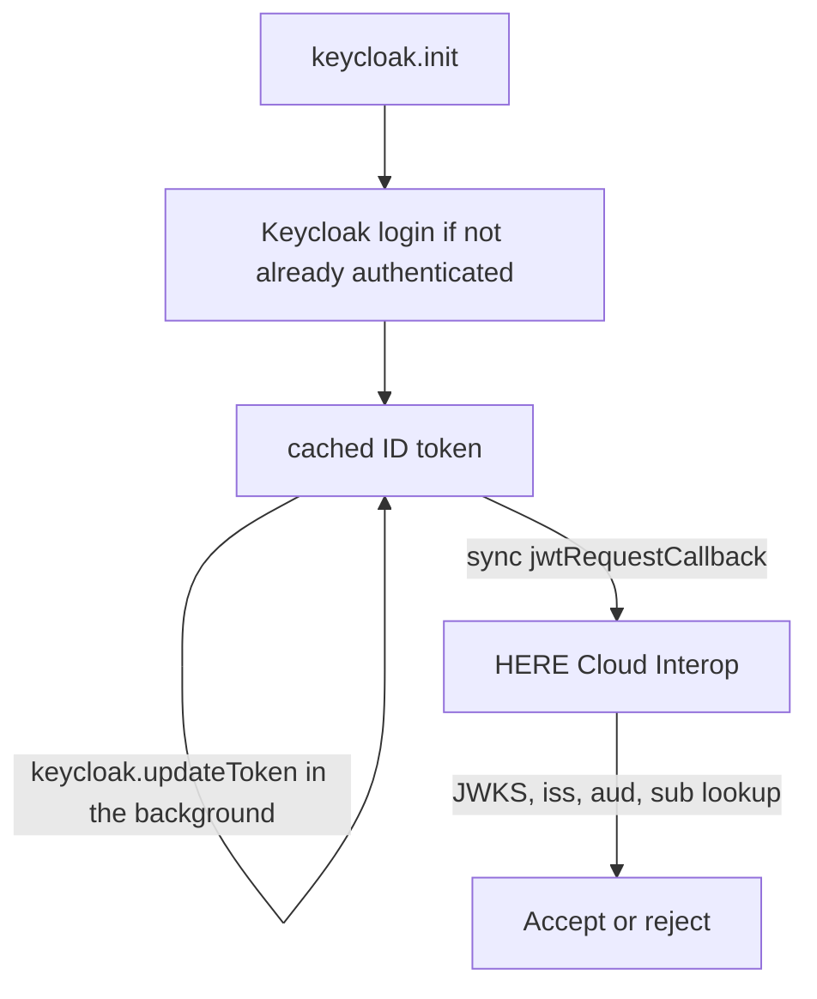

> **_:information_source: HERE Node Adapter:_** [HERE Node Adapter](https://cdn.openfin.co/docs/javascript/32.114.76.14/) is a commercial product and this repo is for evaluation purposes. Use of the HERE Node Adapter and HERE Core components is only granted pursuant to a license from HERE. Please [**contact us**](https://www.here.io/here-core/) if you would like to request a developer evaluation key or to discuss a production license.

# Getting a Keycloak token for HERE Cloud Interop

This page shows **one way** a HERE Container app can acquire a Keycloak token and return it from the synchronous `jwtRequestCallback` that `@openfin/cloud-interop` expects.

Collecting `iss`, `aud`, and `jwks_uri` for HERE is covered in [Using Keycloak with HERE Cloud Interop](./using-keycloak.md). This page is only about **getting the token in the app**. HERE still only verifies what you return; it never signs the JWT.

> **_:warning: This is an example, not a production auth design:_** copy it into your own app, install [`keycloak-js`](https://www.keycloak.org/securing-apps/javascript-adapter), and validate it against your realm and client configuration, session and token lifespans, redirect URIs, chosen token type (`idToken` vs `token`), and a security review. HERE does not certify this wiring for production.

## How acquisition works

`jwtRequestCallback` cannot be async and cannot call Keycloak itself. Sign the user in up front, keep the token in memory, refresh it before it expires, and have the callback return the cached **raw token string**.



This example returns the **ID token** (`keycloak.idToken`), which normally carries the client ID as its `aud`. Register that token's `iss` and `aud` with HERE.

> **_:warning: Access tokens usually have a different `aud`:_** if you return `keycloak.token` (the access token) instead, that is the token whose claims you must send HERE — and a Keycloak access token commonly has `"aud": "account"` rather than your client ID, unless an Audience mapper has been added. See [Finding the audience](./using-keycloak.md#finding-the-audience-aud) for the mapper steps. Whichever token you return, decode that same token when collecting values for HERE.

## Redirect URI

`keycloak.init` completes the login by redirecting back to your app, so the window URL must be listed under **Valid redirect URIs** on the client in the admin console. Keycloak refuses the login with an "Invalid parameter: redirect_uri" error otherwise.

## Example

```ts
import Keycloak from 'keycloak-js';

// Refresh when fewer than this many seconds of the token's life remain.
const MIN_VALIDITY_SECONDS = 60;
const REFRESH_INTERVAL_MS = 30_000;

export async function createKeycloakJwtRequestCallback(options: {
  url: string;
  realm: string;
  clientId: string;
}): Promise<() => string> {
  const keycloak = new Keycloak({
    url: options.url,
    realm: options.realm,
    clientId: options.clientId
  });

  // 'login-required' redirects straight to the Keycloak login page when there is no session.
  // Use 'check-sso' instead if you would rather detect an existing session without redirecting.
  const authenticated = await keycloak.init({ onLoad: 'login-required', pkceMethod: 'S256' });

  if (!authenticated || !keycloak.idToken) {
    throw new Error('Keycloak did not return an ID token. Check the realm, client and scopes.');
  }

  let cachedToken = keycloak.idToken;

  // updateToken only calls Keycloak when the token is close to expiring, so polling is cheap.
  const refreshTimer = setInterval(() => {
    keycloak
      .updateToken(MIN_VALIDITY_SECONDS)
      .then((refreshed: boolean) => {
        if (refreshed && keycloak.idToken) {
          cachedToken = keycloak.idToken;
        }
      })
      .catch((error: unknown) => {
        console.error('Failed to refresh the Keycloak token, keeping the previous one', error);
      });
  }, REFRESH_INTERVAL_MS);

  keycloak.onAuthLogout = () => clearInterval(refreshTimer);

  return () => cachedToken;
}
```

Wire it in after the first token is already cached:

```ts
import { createKeycloakJwtRequestCallback } from './keycloakJwtRequestCallback';

const jwtRequestCallback = await createKeycloakJwtRequestCallback({
  url: 'https://{your-keycloak-host}',
  realm: '{realm}',
  clientId: '{client-id}'
});

const cloudConfig = {
  url: '<CLOUD_INTEROP_SERVICE_URL>',
  platformId: 'my-platform',
  sourceId: 'my-desktop',
  authenticationType: 'jwt',
  jwtAuthenticationParameters: {
    authenticationId: '<PROVIDED_BY_HERE>',
    jwtRequestCallback
  }
};
```

> **_:warning: Return the raw JWT string:_** the callback must return the compact token (`header.payload.signature`), not the `Keycloak` instance or a wrapper object. Returning anything else fails with `JWSInvalid: Invalid Compact JWS`.

## If HERE cannot reach your realm

This page assumes Cloud Interop can fetch your realm's `certs` endpoint, because that is how it verifies the token you return here. If your Keycloak is internal and cannot be reached, do **not** pass a Keycloak-issued token to `jwtRequestCallback` — HERE has no way to verify it.

Use [When HERE cannot reach your JWKS URI](./when-jwks-is-unreachable.md) instead: keep the login above to establish who the user is, then have your app sign its own short-lived HS256 token, putting that user's id in `sub`.

## Reference

- [Using Keycloak with HERE Cloud Interop](./using-keycloak.md) — `iss`, `aud`, and `jwks_uri` to send HERE
- [Keycloak JavaScript adapter](https://www.keycloak.org/securing-apps/javascript-adapter)
- [Getting an Entra ID token for HERE Cloud Interop](./getting-an-entra-token-for-cloud-interop.md) — the same pattern with MSAL.js
- [When HERE cannot reach your JWKS URI](./when-jwks-is-unreachable.md) — the app-signed HS256 fallback
