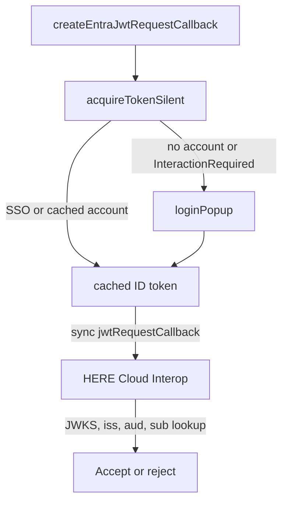

> **_:information_source: HERE Node Adapter:_** [HERE Node Adapter](https://cdn.openfin.co/docs/javascript/32.114.76.14/) is a commercial product and this repo is for evaluation purposes. Use of the HERE Node Adapter and HERE Core components is only granted pursuant to a license from HERE. Please [**contact us**](https://www.here.io/here-core/) if you would like to request a developer evaluation key or to discuss a production license.

# Getting an Entra ID token for HERE Cloud Interop

This page shows **one way** a HERE Container app can acquire a Microsoft Entra ID token and return it from the synchronous `jwtRequestCallback` that `@openfin/cloud-interop` expects.

Collecting `iss`, `aud`, and `jwks_uri` for HERE is covered in [Using Microsoft Entra ID with HERE Cloud Interop](./using-microsoft-entra-id.md). This page is only about **getting the token in the app**. HERE still only verifies what you return; it never signs the JWT.

> **_:warning: This is an example, not a production auth design:_** copy it into your own app, install `@azure/msal-browser`, and validate it against your Entra app registration, Conditional Access policies, redirect URIs, chosen token type (`idToken` vs `accessToken`), and a security review. HERE does not certify this MSAL wiring for production.

## How acquisition works

`jwtRequestCallback` cannot be async and cannot call MSAL itself. Acquire a token up front, keep it in memory, refresh it before it expires, and have the callback return the cached **raw ID token string**.



This example returns the **ID token** (`result.idToken`). Register that token's `iss` and `aud` (typically the Application (client) ID) with HERE. If you pass an **access token** instead, decode _that_ token for `iss` and `aud` — do not mix the two.

## CloudAPAuthEnabled on vs off

`CloudAPAuthEnabled` is a HERE Container / Chrome policy (Chrome 111+), not an MSAL flag. The example neither enables nor requires it.

| Container / policy                                        | First acquisition                                                                                           | After that                                                        |
| --------------------------------------------------------- | ----------------------------------------------------------------------------------------------------------- | ----------------------------------------------------------------- |
| Policy **on**, device Entra ID or hybrid joined           | `acquireTokenSilent` usually succeeds (PRT / WAM, no prompt)                                                | Refresh with `acquireTokenSilent` from MSAL's cache               |
| Policy **off**, no PRT, or an Incognito-equivalent window | Silent fails with `InteractionRequiredAuthError`. An interactive `loginPopup` is **expected**, not an error | Same silent refresh from the cache MSAL populated after the popup |

Do not use `ssoSilent` (hidden iframe) as the default. Microsoft no longer recommends it where third-party cookies are blocked.

Register this window's URL as a **Single-page application** redirect URI on the app registration. Otherwise Entra returns `AADSTS50011`.

## Example

```ts
import { InteractionRequiredAuthError, PublicClientApplication } from '@azure/msal-browser';
import type { AuthenticationResult, PopupRequest, SilentRequest } from '@azure/msal-browser';

const DEFAULT_SCOPES = ['openid', 'profile'];
const REFRESH_BUFFER_RATIO = 0.8;
const FALLBACK_EXPIRY_MS = 3_600_000;

export async function createEntraJwtRequestCallback(options: {
  clientId: string;
  tenantId: string;
  redirectUri?: string;
  loginHint?: string;
}): Promise<() => string> {
  const msal = new PublicClientApplication({
    auth: {
      clientId: options.clientId,
      authority: `https://login.microsoftonline.com/${options.tenantId}`,
      redirectUri: options.redirectUri ?? globalThis.location.origin
    }
  });

  await msal.initialize();

  let cachedToken = '';
  let refreshTimer: ReturnType<typeof setTimeout> | undefined;

  async function acquireIdToken(): Promise<AuthenticationResult> {
    const popupRequest: PopupRequest = { scopes: DEFAULT_SCOPES, loginHint: options.loginHint };
    const silentRequest: SilentRequest = { scopes: DEFAULT_SCOPES, loginHint: options.loginHint };
    const account = msal.getAllAccounts()[0];

    if (account !== undefined) {
      try {
        silentRequest.account = account;
        return await msal.acquireTokenSilent(silentRequest);
      } catch (error: unknown) {
        if (!(error instanceof InteractionRequiredAuthError)) {
          throw error;
        }
      }
    }

    // Expected when CloudAPAuthEnabled is off or there is no PRT yet.
    return await msal.loginPopup(popupRequest);
  }

  async function fetchToken(): Promise<void> {
    const result = await acquireIdToken();
    if (!result.idToken) {
      throw new Error('MSAL returned an empty ID token. Ensure openid is among the scopes.');
    }

    cachedToken = result.idToken;

    const exp = (result.idTokenClaims as { exp?: number } | undefined)?.exp;
    const remainingMs = typeof exp === 'number' ? Math.max(exp * 1000 - Date.now(), 0) : FALLBACK_EXPIRY_MS;

    if (refreshTimer !== undefined) {
      clearTimeout(refreshTimer);
    }
    refreshTimer = setTimeout(() => {
      fetchToken().catch((error: unknown) => {
        console.error('Failed to refresh Entra ID token, keeping the previous token', error);
      });
    }, remainingMs * REFRESH_BUFFER_RATIO);
  }

  await fetchToken();

  return () => cachedToken;
}
```

Wire it in after the first token is already cached:

```ts
import { createEntraJwtRequestCallback } from './entraJwtRequestCallback';

const jwtRequestCallback = await createEntraJwtRequestCallback({
  clientId: '<APPLICATION_CLIENT_ID>',
  tenantId: '<DIRECTORY_TENANT_ID>'
});

const cloudConfig = {
  url: '<CLOUD_INTEROP_SERVICE_URL>',
  platformId: 'my-platform',
  sourceId: 'my-desktop',
  authenticationType: 'jwt',
  jwtAuthenticationParameters: {
    authenticationId: '<PROVIDED_BY_HERE>',
    jwtRequestCallback
  }
};
```

> **_:warning: Return the raw JWT string:_** the callback must return the compact ID token (`header.payload.signature`), not the MSAL result object. Returning anything else fails with `JWSInvalid: Invalid Compact JWS`.

## Reference

- [Using Microsoft Entra ID with HERE Cloud Interop](./using-microsoft-entra-id.md) — `iss`, `aud`, and `jwks_uri` to send HERE
- [MSAL.js single-page apps](https://learn.microsoft.com/en-us/entra/identity-platform/msal-js-sso)
- [Chrome `CloudAPAuthEnabled` policy](https://chromeenterprise.google/policies/#CloudAPAuthEnabled)
- [Getting a Keycloak token for HERE Cloud Interop](./getting-a-keycloak-token-for-cloud-interop.md) — the same pattern with `keycloak-js`
