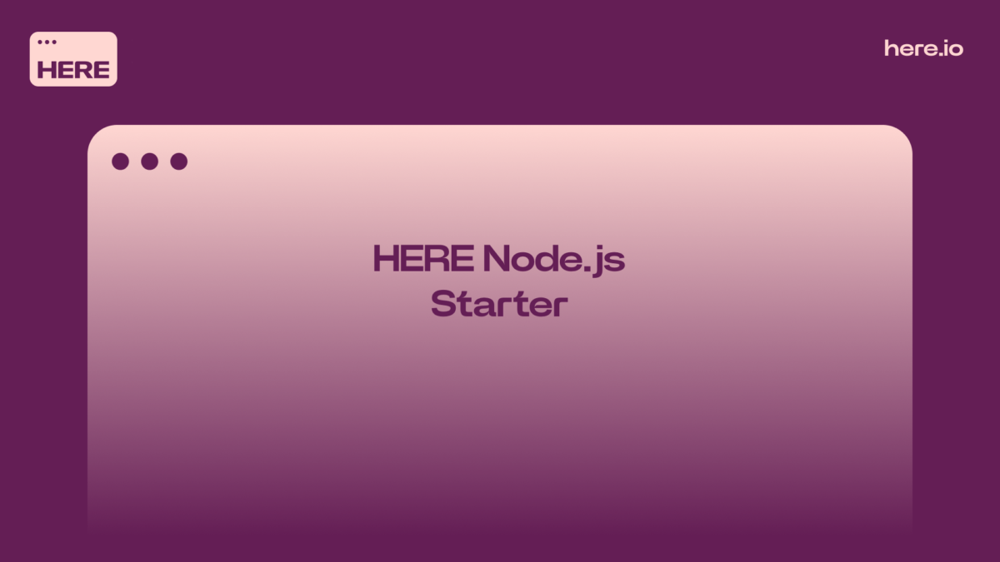
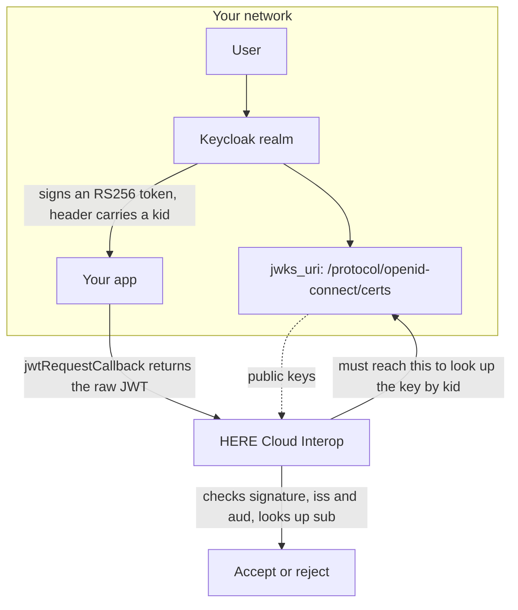

> **_:information_source: HERE Node Adapter:_** [HERE Node Adapter](https://cdn.openfin.co/docs/javascript/32.114.76.14/) is a commercial product and this repo is for evaluation purposes. Use of the HERE Node Adapter and HERE Core components is only granted pursuant to a license from HERE. Please [**contact us**](https://www.here.io/here-core/) if you would like to request a developer evaluation key or to discuss a production license.

# Using Keycloak with HERE Cloud Interop

This guide shows how to collect the values HERE needs to set up JWT authentication for Cloud Interop when your tokens come from **Keycloak**.

It is the real-world equivalent of the [example JWKS endpoint](./README.md) in this folder. That example exists so you can test the whole flow without an identity provider; this guide covers where the same values live in Keycloak.

Keycloak is often deployed on an internal network, so the thing to establish first is whether HERE's Cloud Interop service can reach your realm. If it can, follow this guide. If it genuinely cannot, see [If HERE cannot reach the JWKS URI](#if-here-cannot-reach-the-jwks-uri) at the end.

## How the flow works



The arrow from Cloud Interop back to `certs` is the one that matters. It crosses from HERE into your network, and it is the step that fails on a self-hosted realm. Only that endpoint has to be reachable — it serves public keys, not credentials.

## What to send HERE

Cloud Interop verifies every JWT your app supplies through `jwtRequestCallback`. To do that it needs **all** of the following:

| Value            | Required | Where it comes from                                                          |
| ---------------- | -------- | ---------------------------------------------------------------------------- |
| Issuer (`iss`)   | Always   | The `issuer` in your realm's OIDC discovery document                         |
| Audience (`aud`) | Always   | The `aud` claim on a real token. **Not** published in the discovery document |
| JWKS URI         | Always   | The `jwks_uri` from your realm's OIDC discovery document                     |

> **_:information_source: HERE only verifies:_** HERE never issues or signs tokens. Keycloak signs the JWT, your app returns it from `jwtRequestCallback`, and Cloud Interop uses the values above only to fetch the right public key, check the signature, and confirm `iss` and `aud` match.

<!-- -->

> **_:information_source: `sub` is not a setup value, but it must be a user HERE knows:_** you don't register `sub` with HERE up front. Cloud Interop reads it out of each token at runtime and looks it up against its user table, rejecting the token if there is no match — so the `sub` your tokens carry has to be the identifier that was provisioned for that person in Cloud Interop. Confirm with HERE which identifier they hold if you are unsure.

## Getting the JWKS URI

Keycloak publishes its realm's public keys as a JWK Set, and Cloud Interop fetches a current key each time it needs one, so key rotation keeps working without anyone updating configuration.

### 1. Fetch the realm's discovery document

In the admin console, open your realm and go to **Realm settings** > **General**, then follow the **OpenID Endpoint Configuration** link. Or request it directly:

```bash
curl "https://{your-keycloak-host}/realms/{realm}/.well-known/openid-configuration"
```

Copy these two fields out of the response:

```json
{
  "issuer": "https://{your-keycloak-host}/realms/{realm}",
  "jwks_uri": "https://{your-keycloak-host}/realms/{realm}/protocol/openid-connect/certs"
}
```

> **_:warning: The `/auth` path prefix depends on your version:_** Keycloak 17 and later (the Quarkus distribution) serve these paths at `/realms/{realm}/...`. Keycloak 16 and earlier (the WildFly distribution) used `/auth/realms/{realm}/...`. Rather than assuming, copy `issuer` and `jwks_uri` from your own realm's discovery document — whatever it returns is correct for your deployment.

### 2. Confirm HERE can reach the JWKS URI

This is the step that catches people out with self-hosted Keycloak. The `jwks_uri` has to be reachable **from HERE's Cloud Interop service**, not just from inside your network.

If your Keycloak isn't publicly reachable, you can still use JWKS by:

- putting the realm's `certs` endpoint behind a reverse proxy that HERE can reach, or
- allowing HERE's egress addresses through your firewall (ask HERE for the current list).

Only the JWKS endpoint has to be reachable. It serves public keys, so exposing it does not expose credentials.

If neither is possible, see [If HERE cannot reach the JWKS URI](#if-here-cannot-reach-the-jwks-uri) below.

> **_:warning: Internal and external URLs must agree:_** Keycloak builds the `iss` claim from its configured frontend hostname. If HERE fetches JWKS through one URL but your tokens carry an `iss` from another, verification fails on the issuer check even though the signature is fine. Send HERE the `iss` exactly as it appears in a real token, along with a JWKS URL HERE can actually reach. Setting Keycloak's hostname options (for example `KC_HOSTNAME`) to the public URL keeps the two consistent.

## Finding the audience (`aud`)

The audience is not in the discovery document, so you have to read it off a real token.

1. Sign in through your app so it acquires the token it will hand to `jwtRequestCallback`.
2. Paste that token into a decoder such as [jwt.io](https://jwt.io).
3. Copy the `aud` claim **exactly** as it appears. If `aud` is an array, tell HERE which value Cloud Interop should expect.

ID tokens usually carry the client ID as the audience. **Access tokens often do not** — a Keycloak access token commonly has `"aud": "account"` unless the client has been configured to add one, which surprises people who assume it matches the client ID.

If the `aud` you need isn't there, add an audience mapper:

1. Go to **Clients**, select your client, and open the **Client scopes** tab.
2. Open the client's dedicated scope (named `{client-id}-dedicated`).
3. **Add mapper** > **By configuration** > **Audience**.
4. Set **Included Client Audience** to the client you want in `aud` (or use **Included Custom Audience** for an arbitrary string).
5. Turn on **Add to access token** (and **Add to ID token** if your app sends the ID token).

Acquire a fresh token afterwards and confirm the new `aud` is present before sending it to HERE.

## Confirm before you send

Decode the same token and check all of the following, so the values you send HERE match what Cloud Interop will actually receive:

- `iss` matches the issuer you're sending HERE, character for character.
- `aud` matches the audience you're sending HERE.
- `sub` is present and is the identifier Cloud Interop holds for that user.
- The token header shows `"alg": "RS256"` and a `kid`.
- `exp` is in the future, and your app refreshes the token before it expires.

## Wiring it into Cloud Interop

`@openfin/cloud-interop` takes an `authenticationId` from HERE and a synchronous callback that returns the raw token:

```ts
const cloudConfig = {
  url: '<CLOUD_INTEROP_SERVICE_URL>',
  platformId: 'my-platform',
  sourceId: 'my-desktop',
  authenticationType: 'jwt',
  jwtAuthenticationParameters: {
    authenticationId: '<PROVIDED_BY_HERE>',
    jwtRequestCallback: () => currentKeycloakToken
  }
};
```

> **_:warning: Return the raw JWT string:_** `jwtRequestCallback` must return the compact JWT itself (`header.payload.signature`), not the object your token library wraps it in. Returning anything else fails with `JWSInvalid: Invalid Compact JWS`. The callback is also genuinely synchronous, so acquire and refresh the token in the background and have the callback return the cached value.

## If HERE cannot reach the JWKS URI

Everything above assumes Cloud Interop can fetch your realm's `certs` endpoint. If your Keycloak is on an internal network, work through these in order:

1. **Expose just the JWKS endpoint.** A reverse proxy in front of `/realms/{realm}/protocol/openid-connect/certs`, or a firewall allowlist for HERE's egress addresses, is usually enough. It serves public keys only, so this doesn't expose credentials — and it keeps the simpler setup described above.
2. **If that is genuinely impossible**, your app can keep using Keycloak to authenticate users and sign its own token for Cloud Interop instead. The full steps are in [When HERE cannot reach your JWKS URI](./when-jwks-is-unreachable.md): your app mints a short-lived HS256 JWT with a secret it shares with HERE, and puts the authenticated Keycloak user's id in `sub`.

Note that in that setup the values you send HERE are the ones **your app** puts on the token it signs — not your realm's discovery `issuer` or your client ID, because Keycloak no longer signs the token Cloud Interop sees.

> **_:warning: Neither Keycloak secret is the right value to send HERE:_** the value under a client's **Credentials** tab authenticates your app when it _requests_ tokens; it does not sign the tokens Keycloak issues. And although Keycloak _can_ be configured to issue HS256 tokens, it signs those with a realm-level HMAC key (`hmac-generated` under **Realm settings** > **Keys**), not the client secret — that key is realm-wide, isn't exposed in the admin UI, and is not intended to be handed out. Don't send either one. The only secret HERE should hold is one your own signing code uses.

## Reference

- [Securing applications and services with OpenID Connect](https://www.keycloak.org/securing-apps/oidc-layers)
- [Protocol mappers](https://www.keycloak.org/admin-api/protocol-mappers)
- [Example JWKS endpoint](./README.md) — test the flow without an identity provider
- [Using Microsoft Entra ID with HERE Cloud Interop](./using-microsoft-entra-id.md)
- [When HERE cannot reach your JWKS URI](./when-jwks-is-unreachable.md) — the app-signed HS256 fallback
