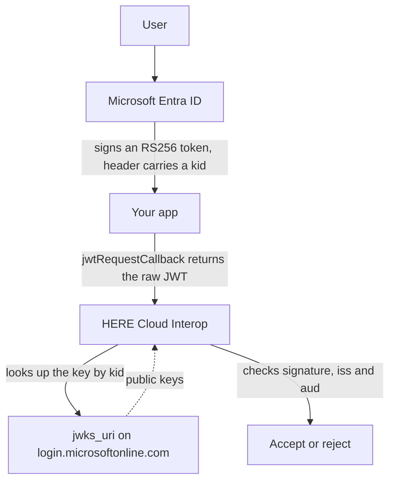

> **_:information_source: HERE Node Adapter:_** [HERE Node Adapter](https://cdn.openfin.co/docs/javascript/32.114.76.14/) is a commercial product and this repo is for evaluation purposes. Use of the HERE Node Adapter and HERE Core components is only granted pursuant to a license from HERE. Please [**contact us**](https://www.here.io/here-core/) if you would like to request a developer evaluation key or to discuss a production license.

# Using Microsoft Entra ID with HERE Cloud Interop

This guide shows how to collect the values HERE needs to set up JWT authentication for Cloud Interop when your tokens come from **Microsoft Entra ID** (formerly Azure AD).

It is the real-world equivalent of the [example JWKS endpoint](./README.md) in this folder. That example exists so you can test the whole flow without an identity provider; this guide covers where the same values live in Entra.

## How the flow works



Entra signs, your app relays, and Cloud Interop verifies. The values in the next section are what let Cloud Interop find the right key and confirm the claims.

## What to send HERE

Cloud Interop verifies every JWT your app supplies through `jwtRequestCallback`. To do that it needs **all** of the following:

| Value            | Required | Where it comes from                                                                   |
| ---------------- | -------- | ------------------------------------------------------------------------------------- |
| Issuer (`iss`)   | Always   | The `issuer` in your tenant's OIDC discovery document, confirmed against a real token |
| Audience (`aud`) | Always   | The `aud` claim on a real token. **Not** published in the discovery document          |
| JWKS URI         | Always   | The `jwks_uri` from your tenant's OIDC discovery document                             |

> **_:information_source: HERE only verifies:_** HERE never issues or signs tokens. Entra signs the JWT, your app returns it from `jwtRequestCallback`, and Cloud Interop uses the values above only to fetch the right public key, check the signature, and confirm `iss` and `aud` match.

<!-- -->

> **_:information_source: Your token must identify the user:_** include `preferred_username`, `username` or `email` in the token. Cloud Interop needs one of these to identify the signed-in user. Entra v2.0 ID tokens carry `preferred_username` by default when the `profile` scope is requested, so this usually needs no extra configuration. How claims map to users is set up per deployment, so discuss claims maps with your HERE representative.

## Getting the JWKS URI

Entra publishes its signing keys at a public URL and rotates them automatically, so Cloud Interop can always fetch a current key.

### 1. Find your tenant ID

In the [Microsoft Entra admin center](https://entra.microsoft.com/), open **Identity** > **Applications** > **App registrations**, select your app, and copy these from the **Overview** page:

- **Directory (tenant) ID** — used in the URLs below.
- **Application (client) ID** — usually the `aud` of an ID token.

### 2. Fetch the discovery document

Request your **tenant-specific** discovery document:

```bash
curl "https://login.microsoftonline.com/{tenant-id}/v2.0/.well-known/openid-configuration"
```

Copy these two fields out of the response:

```json
{
  "issuer": "https://login.microsoftonline.com/{tenant-id}/v2.0",
  "jwks_uri": "https://login.microsoftonline.com/{tenant-id}/discovery/v2.0/keys"
}
```

> **_:warning: Don't use `common` as the issuer:_** the `common` endpoint's discovery document reports its issuer as the literal template string `https://login.microsoftonline.com/{tenantid}/v2.0`, which is a placeholder rather than a usable value. Always request discovery with your real tenant ID, and confirm the result against an actual token as described below.

### 3. Confirm HERE can reach it

The `jwks_uri` is on the public internet (`login.microsoftonline.com`), so this normally just works. If HERE reports that it cannot fetch your keys, check whether you're using a national cloud (see below) or custom signing keys.

## There is no shared-secret alternative with Entra

Entra's discovery document advertises `RS256` as the only supported ID token signing algorithm, so JWKS is the only way to verify an Entra-issued token. There is no HS256 secret to collect.

> **_:warning: An Entra client secret is not a token signing key:_** the values under **Certificates & secrets** on an app registration let your app _request_ tokens from Entra. They are not used to _sign_ the resulting tokens, so an Entra-issued token can never be verified with one. Do not send a client secret to HERE.

If your app isn't passing Entra-issued tokens to `jwtRequestCallback` at all — for example a backend of yours mints its own token and only uses Entra to authenticate the user first — that is a different setup, covered in [When HERE cannot reach your JWKS URI](./when-jwks-is-unreachable.md). It is not something you configure in Entra.

## Finding the audience (`aud`)

The audience is not in the discovery document, so you have to read it off a real token. What it contains depends on which token your app sends to `jwtRequestCallback`.

| Token your app sends | Typical `aud`                                                        |
| -------------------- | -------------------------------------------------------------------- |
| ID token             | Application (client) ID, e.g. `00001111-aaaa-2222-bbbb-3333cccc4444` |
| v2.0 access token    | Client ID of the API being called                                    |
| v1.0 access token    | The API's client ID **or** its Application ID URI, e.g. `api://...`  |

To read it:

1. Sign in through your app so it acquires the token it will hand to `jwtRequestCallback`.
2. Paste that token into [jwt.ms](https://jwt.ms) (Microsoft's decoder) or your own decoder.
3. Copy the `aud` claim **exactly** as it appears. If `aud` is an array, tell HERE which value Cloud Interop should expect.

## Confirm before you send

Decode the same token and check all of the following, so the values you send HERE match what Cloud Interop will actually receive:

- `iss` matches the issuer you're sending HERE, character for character.
- `aud` matches the audience you're sending HERE.
- `preferred_username`, `username` or `email` is present and identifies the signed-in user.
- The token header shows `"alg": "RS256"` and a `kid`.
- `exp` is in the future, and your app refreshes the token before it expires.

> **_:warning: Access tokens may still be v1.0:_** if your token's `iss` is `https://sts.windows.net/{tenant-id}/` rather than `https://login.microsoftonline.com/{tenant-id}/v2.0`, you have a v1.0 token, even though you requested it from a v2.0 endpoint. The format is controlled by the **resource** application's manifest field `requestedAccessTokenVersion` (previously `accessTokenAcceptedVersion`); `null` or `1` means v1.0, `2` means v2.0. Either set it to `2`, or send HERE the `sts.windows.net` issuer that your tokens genuinely use. What matters is that the value you register matches the token.

## Other things that change the URLs

- **National clouds.** Sovereign deployments use a different host, such as `login.microsoftonline.us`. Fetch discovery from that host instead and copy its `issuer` and `jwks_uri`.
- **Custom signing keys.** If the app registration uses custom signing keys via a claims-mapping policy, append the client ID so discovery returns the app-specific keys:

  ```bash
  curl "https://login.microsoftonline.com/{tenant-id}/v2.0/.well-known/openid-configuration?appid={client-id}"
  ```

## Wiring it into Cloud Interop

`@openfin/cloud-interop` takes an `authenticationId` from HERE and a synchronous callback that returns the raw token. How your app obtains that token is application code — typically MSAL.js in the container window.

> **_:information_source: An example of doing this end to end:_** [Use Cloud Interop with Microsoft Entra ID](https://github.com/built-on-openfin/container-starter/tree/main/how-to/use-interop/cloud-interop-entra) in the container starter signs the user in before any HERE code runs, acquires the ID token silently where it can and falls back to a redirect where it cannot, refreshes it in the background, and logs the live `iss`, `aud` and `jwks_uri` so you can read off the values to send HERE. It is an example rather than a production auth design, so validate it against your own app registration, Conditional Access policies, redirect URIs, and security review.

Whatever acquires the token, the callback itself is synchronous, so cache the token and hand back the cached value:

```ts
// Acquire the token before this runs, cache it, and refresh it in the background.
let cachedToken: string;

const cloudConfig = {
  url: '<CLOUD_INTEROP_SERVICE_URL>',
  platformId: 'my-platform',
  sourceId: 'my-desktop',
  authenticationType: 'jwt',
  jwtAuthenticationParameters: {
    authenticationId: '<PROVIDED_BY_HERE>',
    jwtRequestCallback: () => cachedToken
  }
};
```

The linked example reads the same settings from `customSettings.cloudInteropProvider` in its manifest rather than building this object in code. Both arrive at the same place, so use whichever suits your platform.

> **_:warning: Return the raw JWT string:_** `jwtRequestCallback` must return the compact JWT itself (`header.payload.signature`), not the object your token library wraps it in. Returning anything else fails with `JWSInvalid: Invalid Compact JWS`.

## Reference

- [Microsoft identity platform and OpenID Connect](https://learn.microsoft.com/en-us/entra/identity-platform/v2-protocols-oidc)
- [ID token claims reference](https://learn.microsoft.com/en-us/entra/identity-platform/id-token-claims-reference)
- [Access token claims reference](https://learn.microsoft.com/en-us/entra/identity-platform/access-token-claims-reference)
- [Example JWKS endpoint](./README.md) — test the flow without an identity provider
- [Use Cloud Interop with Microsoft Entra ID](https://github.com/built-on-openfin/container-starter/tree/main/how-to/use-interop/cloud-interop-entra) — an example platform that acquires the ID token with MSAL.js and passes it to Cloud Interop
- [Using Keycloak with HERE Cloud Interop](./using-keycloak.md)
- [When HERE cannot reach your JWKS URI](./when-jwks-is-unreachable.md) — the app-signed HS256 fallback
