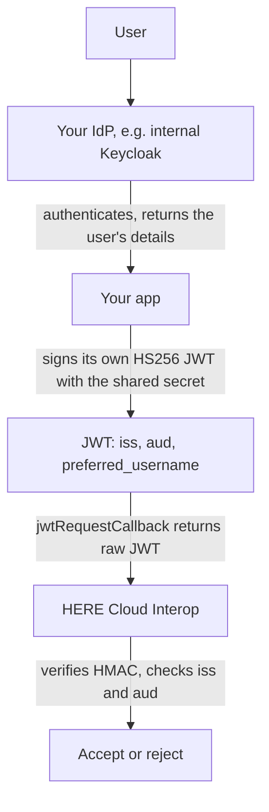

> **_:information_source: HERE Node Adapter:_** [HERE Node Adapter](https://cdn.openfin.co/docs/javascript/32.114.76.14/) is a commercial product and this repo is for evaluation purposes. Use of the HERE Node Adapter and HERE Core components is only granted pursuant to a license from HERE. Please [**contact us**](https://www.here.io/here-core/) if you would like to request a developer evaluation key or to discuss a production license.

# When HERE cannot reach your JWKS URI

This guide covers the fallback for setting up HERE Cloud Interop JWT authentication when Cloud Interop **cannot fetch your identity provider's `jwks_uri`** — for example a Keycloak instance on an internal network, an IdP behind a corporate firewall, or any deployment where you cannot expose an endpoint to HERE.

It is provider-agnostic. It applies equally to Keycloak, Okta, Ping, a homegrown IdP, or anything else whose keys HERE cannot reach.

> **_:warning: Try JWKS first:_** this is a fallback, not the recommended setup. With JWKS, key rotation keeps working on its own and no secret has to be shared with anyone. Only use this guide once exposing the JWKS endpoint has genuinely been ruled out. See [Using Microsoft Entra ID](./using-microsoft-entra-id.md) or [Using Keycloak](./using-keycloak.md) for the preferred path, and note that only the public-key endpoint has to be reachable — a reverse proxy or firewall allowlist in front of it is often enough.

## The idea

Your identity provider keeps doing what it already does: authenticating users. It just stops being the thing that signs the token Cloud Interop sees.

Instead, **your application signs its own short-lived HS256 JWT** using a secret that you generate and share with HERE, carrying the authenticated user's identity.



> **_:information_source: HERE only verifies:_** HERE never issues or signs tokens. Your application signs the JWT; Cloud Interop uses the values below only to check the signature and confirm the claims. The shared secret is you telling HERE which key to verify with, not a key HERE uses to create anything.

## What to send HERE

Every value below describes the token **your app signs**, not anything your identity provider issues.

| Value               | Required | Where it comes from                                                                 |
| ------------------- | -------- | ----------------------------------------------------------------------------------- |
| Issuer (`iss`)      | Always   | A stable string your app chooses and puts on every token, e.g. `my-trading-app`     |
| Audience (`aud`)    | Always   | A stable string your app chooses and puts on every token, e.g. `here-cloud-interop` |
| HS256 shared secret | Always   | A high-entropy secret your app generates and uses to sign the JWT                   |

Because your IdP did not sign this token, do **not** send HERE your IdP's discovery `issuer`, its client ID, or its `jwks_uri`. Those describe tokens Cloud Interop will never see. Send the values your app actually stamps on the JWT.

> **_:warning: Do not send an identity provider secret:_** an OAuth **client secret** authenticates your app when it _requests_ tokens from the IdP — it does not sign the tokens the IdP issues, so it cannot verify them. Equally, do not export your IdP's internal signing key (for example Keycloak's realm `hmac-generated` key) and send that. The only secret HERE should hold is the one **your own signing code** uses, as described here.

## Setting it up

### 1. Authenticate the user with your identity provider

Nothing changes here. Your app performs its normal login against Keycloak, Okta, or whatever you already use, entirely inside your network if that is where it lives. What you need out of it is a **stable identifier for the signed-in user**, such as their username or email address.

### 2. Do not pass the IdP token to the callback

The token your IdP returns is almost certainly RS256, and HERE cannot verify it without fetching your JWKS. Passing it to `jwtRequestCallback` will fail. It is only used by your app to establish who the user is.

### 3. Generate a signing secret and share it with HERE

Generate a high-entropy secret once, store it wherever your app keeps its configuration, and give the same value to HERE alongside your chosen `iss` and `aud`.

```bash
node -e "console.log(require('node:crypto').randomBytes(32).toString('base64url'))"
```

If you want a working setup to test against before wiring up your own, the [example JWKS endpoint](./README.md) in this folder issues HS256 tokens and shows you the matching secret to copy.

### 4. Sign a JWT for Cloud Interop

Sign a short-lived token with that secret, using the `iss` and `aud` you registered and the user details from step 1:

```ts
import jwt from 'jsonwebtoken';

const token = jwt.sign(
  {
    sub: authenticatedUser.id,
    preferred_username: authenticatedUser.username,
    iss: 'my-trading-app',
    aud: 'here-cloud-interop'
  },
  process.env.CLOUD_INTEROP_SIGNING_SECRET,
  { algorithm: 'HS256', expiresIn: '1h' }
);
```

> **_:warning: Your token must identify the user:_** include `preferred_username`, `username` or `email` in the token. Cloud Interop needs one of these to identify the signed-in user, and because your app is minting this token itself, it is your code that has to put the value there. How claims map to users is set up per deployment, so discuss claims maps with your HERE representative.

### 5. Return the raw token from the callback

```ts
const cloudConfig = {
  url: '<CLOUD_INTEROP_SERVICE_URL>',
  platformId: 'my-platform',
  sourceId: 'my-desktop',
  authenticationType: 'jwt',
  jwtAuthenticationParameters: {
    authenticationId: '<PROVIDED_BY_HERE>',
    jwtRequestCallback: () => currentToken
  }
};
```

> **_:warning: Return the raw JWT string:_** `jwtRequestCallback` must return the compact JWT itself (`header.payload.signature`), not the object your token library wraps it in. Returning anything else fails with `JWSInvalid: Invalid Compact JWS`. The callback is also genuinely synchronous, so mint and refresh the token in the background and have the callback return the cached value.

## Confirm before you go live

Decode a token your app has just signed and check:

- The header shows `"alg": "HS256"`.
- `iss` and `aud` match the values you sent HERE, character for character.
- `preferred_username`, `username` or `email` is present and identifies the signed-in user.
- `exp` is in the future, and your app refreshes the token before it expires.
- Verifying the token with the shared secret succeeds. The example server's `POST /api/verify` can do this for you.

## Things to keep in mind

- **HS256 is symmetric.** Anyone holding the secret can mint tokens indistinguishable from yours. Store it like any other production credential, never in source control or client-side code.
- **The secret has no expiry.** Only the tokens it signs do. Agree a rotation process with HERE.
- **Revisit JWKS periodically.** If your network setup changes so that HERE can reach a JWKS endpoint, moving to RS256 removes the shared secret entirely.

## Reference

- [Example JWKS endpoint](./README.md) — issues HS256 tokens and shows the matching secret
- [Using Microsoft Entra ID with HERE Cloud Interop](./using-microsoft-entra-id.md) — the preferred JWKS path
- [Using Keycloak with HERE Cloud Interop](./using-keycloak.md) — the preferred JWKS path
